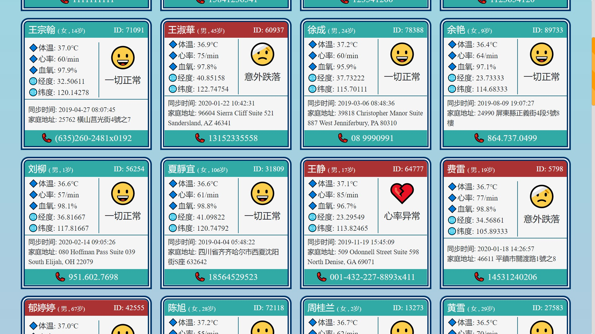
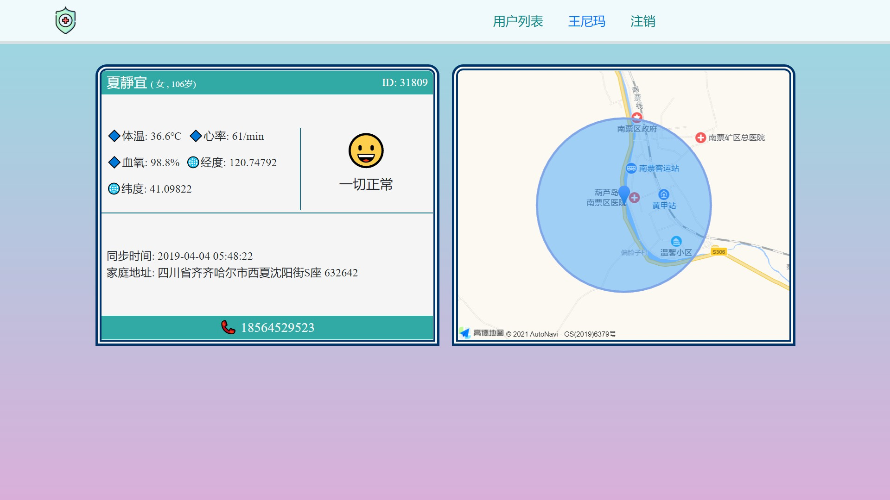

# Safe Guard 健康卫士


## Summary
1. 跟踪监测用户的体温、心率、血氧。
2. 意外伤害，及时警报。
3. 可视化用户的当前位置。

## Installation
```angular2html
pip install -r requirements/common.txt
```

## Dependency
Flask + Jinja2 + MySQL + Faker + AMap

## Development
Generate some fake users with Faker package.

## Showcase:
1. Users 

2. Single user 

## License
MIT
